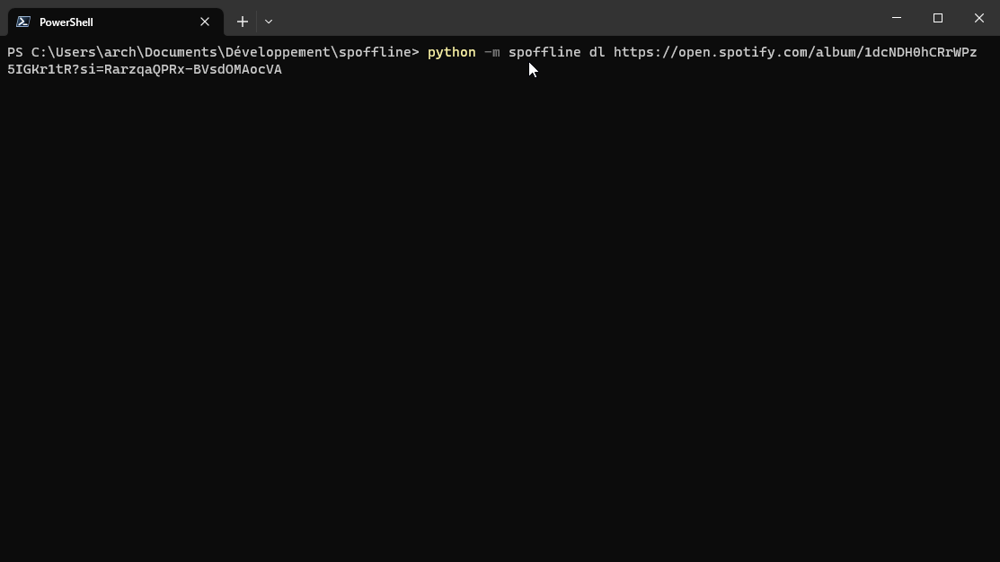
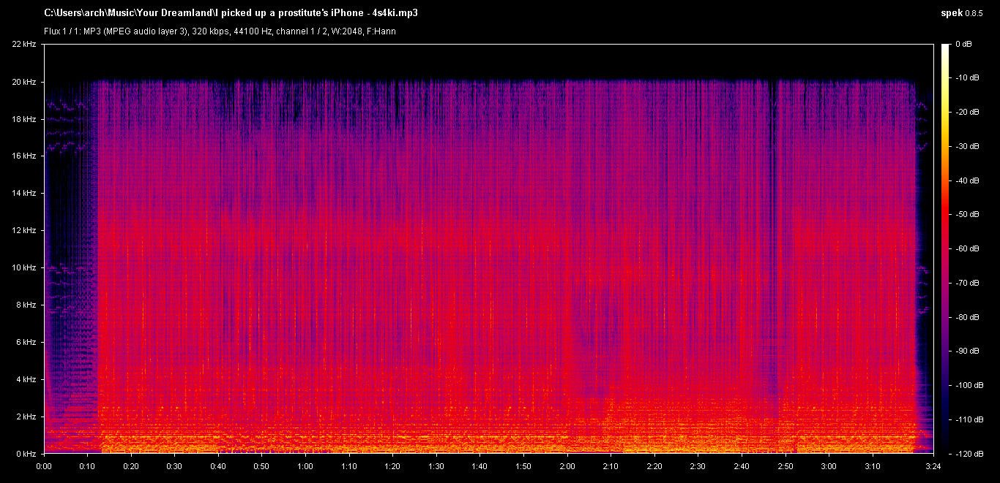

<div>
    <h1 align="center">Spoffline<br>Next gen spotify downloader</h1>
</div>

<br>

<h2>Requirements</h2>

- **Python** (up to 3.10)
- **FFMPEG** (can be downloaded [here](https://github.com/BtbN/FFmpeg-Builds/releases))

<h2>Installation</h2>

Install python requirements

```shell
$ pip install -r requirements.txt
```

You must config your account in the config.yml file:

```yaml
credentials:
    email: xxx@xxx.xxx
    password: xxx
```

<h2>Usage</h2>

```shell
$ python -m spoffline dl [URL]
```
*(Only music can be downloaded for now)*

<h2>Example</h2>




<h2>TODO List</h2>

- [x] Add support for playlist
- [ ] Add support for artist albums
- [ ] Add api support (to embed it in other projects)
- [ ] ~~Add support for episode~~
- [ ] ~~Add support for show~~
- [ ] ~~Add support for e-book (available only in some country)~~
