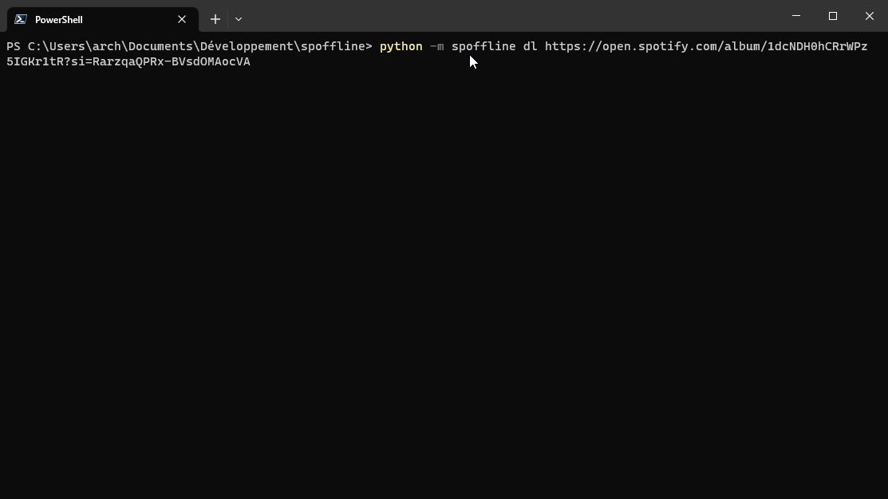

<div>
    <h1 align="center">Spoffline<br>Next gen spotify downloader</h1>
</div>

<br>

<h2>Requirements</h2>

- **Python** (up to 3.10)
- **FFMPEG** (can be downloaded [here](https://github.com/BtbN/FFmpeg-Builds/releases))

<h2>Installation</h2>

```shell
$ pip install -U "git+https://github.com/retouching/spoffline.git"
```

<h2>Usage</h2>

<h3>1. CLI mode</h3>

You must config your account:

```shell
$ python -m spoffline auth [EMAIL] [PASSWORD]
```

Next you can download: *(premium have 320kbp/s streams and free only 160kbp/s)*

```shell
$ python -m spoffline dl [URL]
```



*(Only music can be downloaded for now)*

<h3>2. Module mode</h3>

Examples can be found [here](./examples)

<h2>Warning: Some things need to be considered</h2>

 - This project is not approved by Spotify
 - The worst that can happen is that you will be banned from Spotify
 - Some track are only available in some countries (example with [Re-sublimity by KOTOKO](https://open.spotify.com/track/5ZBVGPIBgqjfJmzsd0IyP7) only available in Japan)
